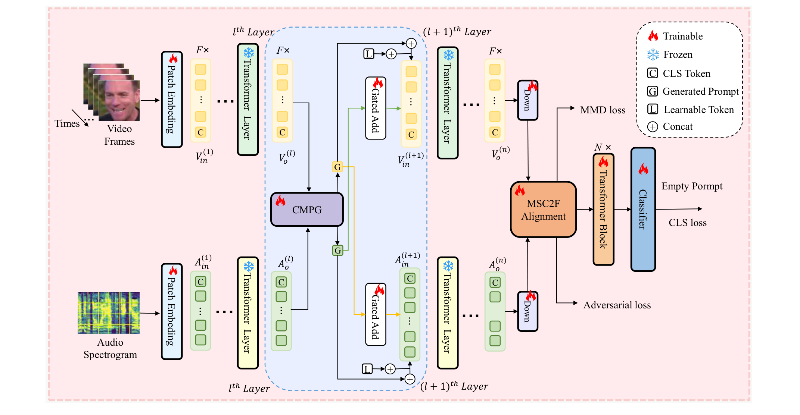

<div align="center">

# BHGap

### A Deep Iterative Prompting and Multi-stage Alignment Framework for Dynamic Facial Expression Recognition

<p>
  <a href="https://doi.org/10.1145/3774904.3792417"></a>
  <a href="https://doi.org/10.1145/3774904.3792417"></a>
  <a href="https://huggingface.co/NiDeYingZiD/BHGap-ckpt"></a>

</p>

**[Yichi Zhang](mailto:51285902110@stu.ecnu.edu.cn), [Yunqi Han](mailto:51275902170@stu.ecnu.edu.cn), [Jiayue Ding](mailto:51285902128@stu.ecnu.edu.cn), [Liangyu Chen](mailto:lychen@sei.ecnu.edu.cn)<sup>†</sup>**

Shanghai Key Laboratory of Trustworthy Computing, East China Normal University

<sup>†</sup> Corresponding author

[**📄 Paper**](https://doi.org/10.1145/3774904.3792417) · [**🤗 Checkpoints**](https://huggingface.co/NiDeYingZiD/BHGap-ckpt) · [**🚀 Getting Started**](#-getting-started) · [**📌 Citation**](#-citation)

</div>

---

## 📖 Abstract

Dynamic Facial Expression Recognition (DFER), as a crucial part of affective computing, has broad applications in many areas such as human-computer interaction and social media content analysis. Effectively integrating multimodal information, particularly audio-visual signals, remains the core challenge. However, existing approaches are generally constrained by two major challenges: (1) shallow and static fusion mechanisms, which fail to capture the dynamic co-evolution of audio-visual features during deep interaction; (2) implicit and coarse alignment strategies, which are insufficient to bridge the modality gap caused by heterogeneous feature distributions. To address these issues, we propose a novel framework, **BHGap**, which integrates deep iterative prompt generation with multi-stage feature alignment and fusion. The key idea is to reformulate audio-visual collaboration from a one-shot fusion event into a continuous, reciprocal generation process that spans every layer of frozen backbone encoders. Specifically, we design a State Space Model (SSM)-based cross-modal prompt generator that dynamically produces "guidance prompts" for the counterpart modality at each encoding layer, thereby enabling deep and fine-grained feature co-evolution. Beyond encoding, we further introduce a coarse-to-fine multi-stage alignment module: at the macro level, low-rank adversarial alignment is employed to establish spatio-temporal congruity between audio and video while reducing global distributional discrepancies; at the micro level, Maximum Mean Discrepancy (MMD) constraints combined with implicit differentiation optimization ensure fine-grained statistical consistency and semantic alignment. Extensive experiments on the public DFEW and MAFW datasets demonstrate that our method achieves state-of-the-art performance, offering a new paradigm of deep iterative fusion and explicit alignment for multimodal emotion recognition.

<div align="center">

<br>
<em>Figure 1. Overview of BHGap: frozen audio-visual encoders + SDIC (iterative cross-modal prompting) + MSC2F (coarse-to-fine alignment) + lightweight fusion.</em>
</div>

---

## 🚀 Getting Started

### ⚙️ 1. Environment

Tested with Python 3.10, PyTorch 2.1.1 and CUDA on a single NVIDIA A100-40G GPU.

```bash
# (recommended) create a clean environment
conda create -n bhgap python=3.10 -y
conda activate bhgap

# install dependencies
pip install -r requirements.txt
```

> **Note** — `mamba-ssm` and `causal-conv1d` require a CUDA toolchain. If you hit build errors, install matching prebuilt wheels for your CUDA/PyTorch version, or build from source following the [Mamba](https://github.com/state-spaces/mamba) instructions.

### 🧠 2. Pre-trained backbones

BHGap initializes its frozen encoders from public self-supervised checkpoints. Please download the pre-trained weights from the official repositories below, then update the corresponding `ckpt_path` in [`models/Generate_Model.py`](models/Generate_Model.py):

| Backbone | Download | Used by |
| --- | --- | --- |
| **MAE-Face** (visual ViT-Base) | [FuxiVirtualHuman/MAE-Face](https://github.com/FuxiVirtualHuman/MAE-Face) | `_build_image_model(...)` |
| **AudioMAE** (audio ViT-Base) | [facebookresearch/AudioMAE](https://github.com/facebookresearch/AudioMAE) | `_build_audio_model(...)` |

```python
# models/Generate_Model.py
def _build_audio_model(self, ..., ckpt_path='/path/to/audiomae_pretrained.pth'): ...
def _build_image_model(self, ..., ckpt_path='/path/to/mae_face_pretrain_vit_base.pth'): ...
```

### 🗂️ 3. Data preparation

We use two public, in-the-wild benchmarks: **[DFEW](https://dfew-dataset.github.io/)** (16,372 clips, 7 emotions) and **[MAFW](https://mafw-database.github.io/MAFW/)** (10,045 clips, 11 emotions). The expected data layout (pre-extracted frames per clip + extracted `.wav` audio) is:

```
<DATA_ROOT>/
├── dfew/dfew/Clip/clip_224x224/00001/<frames>.jpg   # video frames
├── dfew/dfew/raw_wav/00001.wav                       # audio
└── mafw/clips_faces/00025/<frames>.jpg               # MTCNN face frames
    mafw/clips_wav/00025.wav
```

For downloading the datasets and preparing/preprocessing the data (face cropping, audio extraction, and annotation lists), please follow the pipeline described in **[MMA-DFER](https://github.com/katerynaCh/MMA-DFER)**.

> **Note** — Depending on your local directory naming, you may need to adjust the modality / path keywords used to locate the audio `.wav` files in [`dataloader/video_dataloader.py`](dataloader/video_dataloader.py) (lines **163–170**), e.g. `clip_224x224` → `raw_wav` for DFEW and `clips_faces` → `clips_wav` for MAFW.

### 🏋️ 4. Training

5-fold training runs end-to-end via the provided scripts (only the lightweight modules are trainable; backbones stay frozen):

```bash
bash train_DFEW.sh    # train on DFEW
bash train_MAFW.sh    # train on MAFW
```

Or call `main.py` directly to customize hyper-parameters:

```bash
CUDA_VISIBLE_DEVICES=0 python main.py \
  --dataset DFEW \
  --epochs 25 \
  --batch-size 8 \
  --lr 3e-5 \
  --weight-decay 1e-2 \
  --img-size 224 \
  --adv-weight 0.2 \
  --mmd-weight 0.1 \
  --exper-name FINAL_224
```

### 📦 5. Trained checkpoints (Model Zoo)

We release the trained BHGap weights on the Hugging Face Hub: **[🤗 NiDeYingZiD/BHGap-ckpt](https://huggingface.co/NiDeYingZiD/BHGap-ckpt)**. Download them with either of the following:

```bash
huggingface-cli download NiDeYingZiD/BHGap-ckpt --local-dir ./checkpoints
```

```python
from huggingface_hub import snapshot_download
snapshot_download(repo_id="NiDeYingZiD/BHGap-ckpt", local_dir="./checkpoints")
```

### 📈 6. Evaluation

Evaluate a checkpoint (e.g. one downloaded above) under 5-fold cross-validation:

```bash
python evaluate.py --dataset DFEW --checkpoint ./checkpoints/model_best_war.pth --fold 5
```

---

## 🙏 Acknowledgements

Our implementation builds upon excellent prior work, including [MAE-Face](https://github.com/FuxiVirtualHuman/MAE-Face), [AudioMAE](https://github.com/facebookresearch/AudioMAE), [Mamba](https://github.com/state-spaces/mamba), [MMA-DFER](https://github.com/katerynaCh/MMA-DFER), [DFEW](https://dfew-dataset.github.io/) and [MAFW](https://mafw-database.github.io/MAFW/). Thank you for these excellent efforts! They have provided significant assistance to our research!

---

## 📌 Citation

If you find this work useful, please consider citing:

```bibtex
@inproceedings{zhang2026bhgap,
  title     = {BHGap: A Deep Iterative Prompting and Multi-stage Alignment Framework for Dynamic Facial Expression Recognition},
  author    = {Zhang, Yichi and Han, Yunqi and Ding, Jiayue and Chen, Liangyu},
  booktitle = {Proceedings of the ACM Web Conference 2026 (WWW '26)},
  year      = {2026},
  address   = {Dubai, United Arab Emirates},
  publisher = {Association for Computing Machinery},
  doi       = {10.1145/3774904.3792417}
}
```
